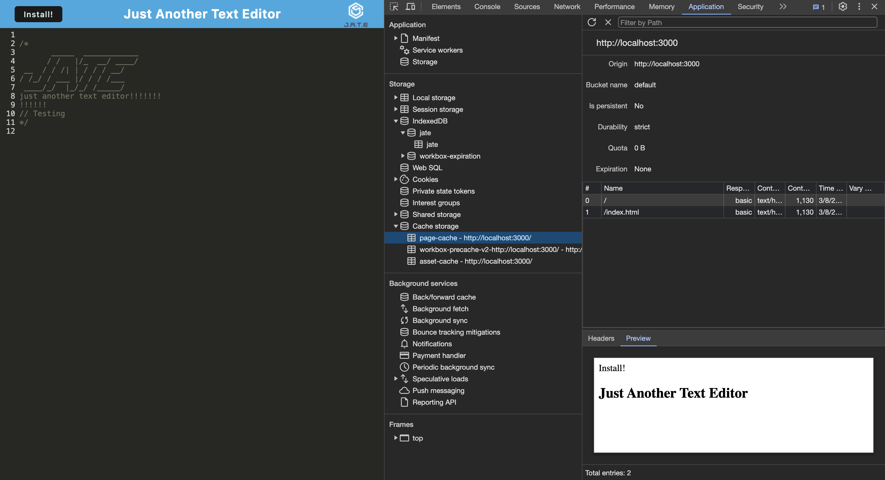

# Progressive Web Application (PWA) - Text Editor

## Description
This text editor has been refactored to be a Progressive Web Application, allowing users to download it from the web and use it offline with persitent data. In order to refactor it, I added various plug-ins and configured them to the starter code.

This project taught me:
* How to customize Webpack plug-ins to correspond with an application
* How to cache data to optimize load times after the first use
* How to use concurrently to run multiple CLI operations at once
* How to create requests to the database used IndexedDB
* and more

## Installation
n/a

## Usage
When this application is used, it saves the data to the database and creates a cache so that the data is persistent.

## Credits
Starter code: https://github.com/coding-boot-camp/cautious-meme

## License
n/a